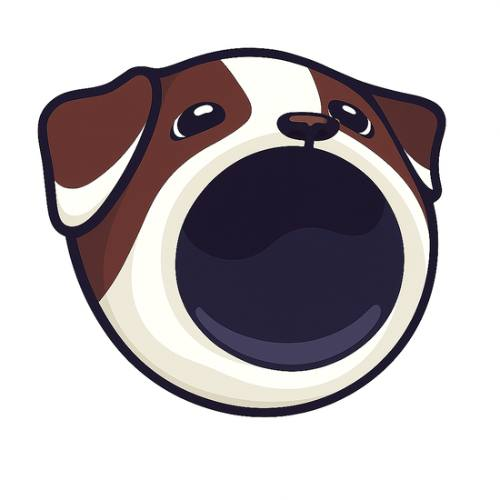

# 🐕 Popdog - The Dog That Pops

A modern, interactive memecoin website featuring Popdog - the chaotic dog that pops into everything. Built with vanilla HTML, CSS, and JavaScript for maximum performance and compatibility.



## 🌟 Features

### Interactive Popdog Experience
- **Click to Pop**: Interactive Popdog image that responds to clicks with animations
- **Pop Counter**: Track how many times Popdog has popped
- **Sound Effects**: Audio feedback on each pop
- **Mouth Animation**: Toggle between open and closed mouth states

### Popdog Payment Solution
- **Send PopDog Transfer Panel**: Clean, modern fintech-inspired UI
- **Real-time USD Conversion**: Automatic price calculation (1 PopDog = $0.01)
- **Wallet Integration**: Connect with Phantom and Solflare wallets
- **Mobile Optimized**: Fully responsive design for all devices
- **No Fees, No Friction**: Instant transfers across wallets

### Payment Gateway
- **x402 Payment Integration**: Built-in payment card for content access
- **x402 SDK Support**: Full integration with Rapid402 SDK for Solana
- **Solana Wallet Support**: Seamless connection with Phantom and Solflare
- **Network Detection**: Automatic Solana network detection
- **Micropayments**: On-chain micropayments over HTTP protocol

### Modern UI/UX
- **Responsive Design**: Optimized for desktop, tablet, and mobile
- **Smooth Animations**: CSS animations and transitions throughout
- **Clean Design**: Minimalist, modern interface
- **Accessibility**: Semantic HTML and proper ARIA labels

## 🚀 Tech Stack

- **HTML5**: Semantic markup
- **CSS3**: Modern styling with CSS variables, flexbox, and grid
- **Vanilla JavaScript**: No frameworks, pure performance
- **Solana Web3**: Wallet integration via window.solana API
- **Responsive Design**: Mobile-first approach

## 📁 Project Structure

```
popdog/
├── index.html              # Main HTML file
├── styles.css              # All styles and responsive design
├── logo.jpg                # Popdog logo
├── banner.jpg              # Banner image
├── mouthopen.jpg           # Popdog with open mouth
├── mouthclose.png          # Popdog with closed mouth
├── meme.jpg                # Meme image
├── pic.jpg                 # Additional image
├── cat-mouth-noise-192-kbps.mp3  # Sound effect
├── README.md               # This file
├── LICENSE                 # MIT License
├── TECHNICAL.md            # Technical documentation
├── X402_INTEGRATION.md     # x402 payment system integration guide
├── X402_SDK_GUIDE.md       # x402 SDK quick start guide
├── CONTRIBUTING.md         # Contribution guidelines
├── DEPLOYMENT.md           # Deployment guide
└── .gitignore              # Git ignore file
```

## 🎯 Key Sections

1. **Hero Section**: Interactive Popdog with pop counter
2. **About Section**: Information about Popdog memecoin
3. **Send PopDog Section**: Payment transfer panel
4. **Meme Wall**: Gallery of Popdog memes
5. **Community Section**: Links to social media and community

## 💻 Getting Started

### Prerequisites
- A modern web browser (Chrome, Firefox, Safari, Edge)
- Solana wallet extension (Phantom or Solflare) for wallet features

### Installation

1. Clone the repository:
```bash
git clone https://github.com/Popdogos/Popdog.git
cd Popdog
```

2. Open `index.html` in your browser:
```bash
# Using Python
python -m http.server 8000

# Using Node.js
npx http-server

# Or simply open index.html directly in your browser
```

3. Visit `http://localhost:8000` in your browser

## 🔧 Development

### Local Development

The project uses vanilla web technologies, so no build process is required. Simply:

1. Edit `index.html` for structure
2. Edit `styles.css` for styling
3. Edit the `<script>` section in `index.html` for functionality
4. Refresh your browser to see changes

### Browser Support

- Chrome (latest)
- Firefox (latest)
- Safari (latest)
- Edge (latest)
- Mobile browsers (iOS Safari, Chrome Mobile)

## 📱 Mobile Optimization

The site is fully optimized for mobile devices:

- **Touch-friendly**: Minimum 44px touch targets
- **Responsive Layout**: Adapts to all screen sizes
- **iOS Zoom Prevention**: Prevents unwanted zoom on input focus
- **Performance**: Optimized CSS and JavaScript
- **Accessibility**: Proper semantic HTML

## 🔐 Wallet Integration

### Supported Wallets
- **Phantom**: Primary Solana wallet
- **Solflare**: Alternative Solana wallet

### Features
- Automatic wallet detection
- Connection/disconnection handling
- Address display (truncated for privacy)
- Event listeners for wallet state changes

## 🎨 Design System

### Colors
- **Primary Yellow**: `#FFD700` (Golden Yellow)
- **Brown**: `#8B4513`
- **Orange**: `#FF6B35`
- **Background**: `#FFF8E1` (Pale Yellow)

### Typography
- **Font Family**: System fonts (-apple-system, BlinkMacSystemFont, Segoe UI, Roboto)
- **Headings**: Bold, 800 weight
- **Body**: Regular, 400-600 weight

## 📄 License

This project is licensed under the MIT License - see the [LICENSE](LICENSE) file for details.

## 🤝 Contributing

Contributions are welcome! Please feel free to submit a Pull Request.

1. Fork the repository
2. Create your feature branch (`git checkout -b feature/AmazingFeature`)
3. Commit your changes (`git commit -m 'Add some AmazingFeature'`)
4. Push to the branch (`git push origin feature/AmazingFeature`)
5. Open a Pull Request

## 📞 Contact & Community

- **Twitter/X**: [@popdog_0](https://x.com/popdog_0?s=21)
- **Community**: [Popdog Community](https://x.com/i/communities/1989024087017234529)
- **Contract Address**: `BpHUVW5Hbm2M9g1U6H8QRoCs1PGoDrSqWW3Cs4w2pump`

## ⚠️ Disclaimer

This site is a meme project and makes no guarantees or promises. Not financial advice. Purely for fun.

## 🙏 Acknowledgments

- Built with ❤️ for the Popdog community
- Inspired by modern fintech UI/UX design
- Solana blockchain integration

---

**Popdog ~ The dog that pops.** 🐕💥

